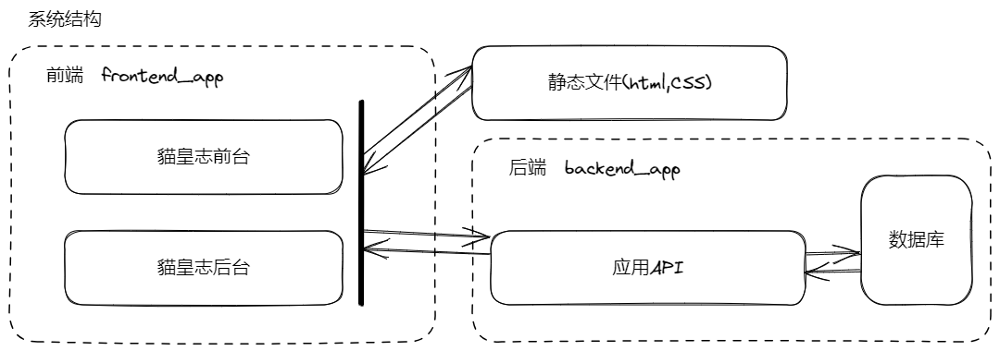
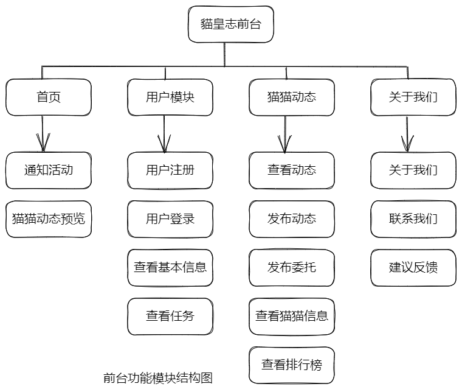
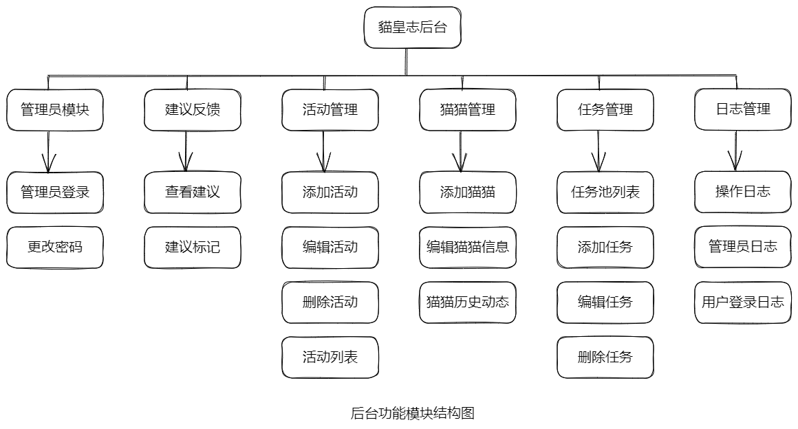

  <picture>
    <source media="(prefers-color-scheme: dark)" srcset="https://raw.githubusercontent.com/sxdl/catlog/master/catlog/frontend_app/static/img/Light_Cap_CatLog_LOGO_800-800.png">
    
  </picture>

<h1 align="center">
  CatLog——貓皇志
</h1>

  一个专注于记录猫主子活动的铲屎官交流平台

  

  

  

## 这个项目想做什么？
我们希望打造一个***有别于传统爱猫人士交流平台的论坛社区***.

这里的一切***以猫为本***(ﾐචᆽචﾐ)

毕竟有什么比我们所爱的猫猫更适合做这个社区的主人呢(=ඒᆽඒ=)
。。。（待补充）

---

这是一个**校园流浪猫每日动态分享平台**，旨在让ee们随时随地了解到流浪猫们的近期动态。

用户可以参与记录校园流浪猫的每日动态、在动态下发表评论、发布和接收委托、完成猫猫互动任务

---

## Features

- [ ] 动态模块：用户可以查看、发布猫猫动态。可以支持筛选满足指定猫、时间范围条件的动态。可以在每条动态下发表评论。管理员可以修改动态的标签。
- [ ] WIKI模块：用户可以查看猫猫的基本信息（品种、猫龄、是否绝育、活动范围等），管理员可以编辑猫猫信息和创建新的猫猫。
- [ ] 用户模块：用户的信息管理。包括用户的昵称、uid、头像、经验、等级、称号、历史动态、完成的任务、委托、功能权限。用户可以修改昵称、头像、选择佩戴称号。新用户的注册，用户的登录，用户完成任务，委托后，更新经验值。
- [ ] 任务委托系统：系统从任务池中抽取任务发布到用户，系统任务包括每日任务、成长任务以及所有用户共享的悬赏任务。用户达到一定等级后，可以发布委托任务等待其他用户完成。用户可以完成系统任务或委托任务以获取经验值等 奖励。
- [ ] 用户经验成长系统：用户可以通过发布动态、完成系统任务、完成委托任务、参与活动来获取经验。用户持续累计经验，根据经验值的总量划分用户的等级、称号。提升等级可以用于解锁更多的社区功能权限。

- [ ] 管理员模块：管理员的权限组管理。超级管理员拥有后台系统最高权限，可以创建管理员权限组（如一般管理员权限组包含以下权限：日志查看、动态管理、Wiki编辑；宣传管理员权限组包含以下权限：编辑和发布活动、发布悬赏任务）

## 项目结构

catlog是项目的根目录，其下包含三个文件夹和三个.py文件。

##### 文件夹：

* idea文件夹，是py的配置文件。

* back_end后端的代码。
  * main文件夹：

init.py：创建蓝图

errors.py：

views.py：

template文件夹：用于存放后端的html源码

init.py文件：定义create_app函数来创建后端

* front_end前端的代码。
  * main文件夹：

 __init__.py：创建蓝图

errors.py：

views.py：

template文件夹：用于存放后端的html源码。

init.py文件：定义create_app函数来创建前端

##### .py文件：

* init.py：定义Create_app函数，用于定义初始化前后端，以及接受请求方式。

* config.py：用于flask框架的调试。
  * Config类：用于初始化配置

DevelopmentConfig类：用于开发环境的配置，及指定数据库地址。

TestingConfig 类：用于设置测试相关的配置选项

ProductionConfig类：生产环境的配置类

config 字典：方便查看配置信息

* db.py，用于创建数据库。
  * 使用SQLAlchemy 库来定义了数据库模型类base。

创建db对象进行连接数据库、执行查询以及管理数据库模型。

定义了两个数据库模型类User和Roles

## 技术方案

flask + layui

https://layui.dev/

## Future

- 移动端应用开发
- 邮件、站内信接口、自动发送功能
- 拍小视频，分享小红书、微博、抖音、微信朋友圈